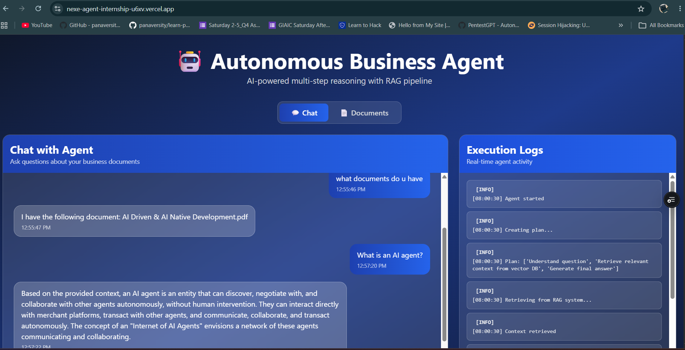
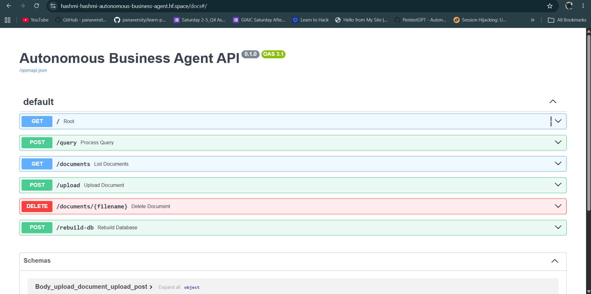

# 🤖 Autonomous Business Agent

**A full-stack AI application that answers questions over uploaded PDF documents using a Retrieval-Augmented Generation (RAG) pipeline.**

The system simulates an autonomous AI worker capable of:

- 🧠 Planning tasks
- 🔍 Retrieving relevant knowledge
- 🤖 Reasoning using an LLM
- 📜 Logging every execution step

It includes a **FastAPI backend**, a **Next.js frontend**, semantic search with **ChromaDB**, and is deployed on **Hugging Face Spaces** and **Vercel**.

---

# 🌐 Live Demo

### Backend API (Hugging Face)

https://huggingface.co/spaces/hashmi-hashmi/autonomous-business-agent

### Frontend (Vercel)

https://nexe-agent-internship-u6xv.vercel.app/

---

# 📸 Screenshots

### 💬 Chat Interface



Ask questions through the web interface while viewing the agent's responses and execution logs.

---

### 📄 Document Manager

.png)
.png)

Upload, manage, and process PDF documents to build the RAG knowledge base.

---

### 🔌 FastAPI Swagger API



Interactive API documentation for testing backend endpoints such as `/query`, `/upload`, `/documents`, and `/rebuild-db`.

---

### 📜 Backend Execution Logs

.png)
.png)
.png)
.png)

Execution pipeline showing planning, retrieval, reasoning, and response generation in real time.

---

# ✨ Features

- 📄 Upload PDF documents
- 🔍 Semantic search using ChromaDB
- 🧠 Retrieval-Augmented Generation (RAG)
- 🤖 LLM-powered question answering
- 📋 Autonomous task planning
- 📜 Execution logs for every request
- ⚡ FastAPI backend
- 🌐 Modern Next.js frontend
- 🚀 Deployed on Hugging Face + Vercel

---

# 🏗 Architecture

```
                User
                  │
                  ▼
         Next.js Frontend
                  │
                  ▼
          FastAPI Backend
                  │
                  ▼
        Autonomous AI Agent
                  │
       ┌──────────┴──────────┐
       ▼                     ▼
 ChromaDB Retrieval     Gemini LLM
       │                     │
       └──────────┬──────────┘
                  ▼
          Final AI Response
```


---

# ⚙️ How It Works

```
User Question
      │
      ▼
Task Planning
      │
      ▼
Vector Retrieval
      │
      ▼
Context Injection
      │
      ▼
LLM Reasoning
      │
      ▼
Final Answer
      │
      ▼
Execution Logs
```

---

# 💬 Example

### User

```
What is AI Native Development?
```

### Agent

```
AI Native Development refers to systems where AI is integrated into
the core design rather than being added later...
```

### Execution Logs

```
Agent started
↓

Creating plan

↓

Retrieving context

↓

Generating response

↓

Finished
```

---

# 🧠 Technologies Used

### AI

- OpenAI Agents SDK
- Gemini API
- SentenceTransformers
- ChromaDB

### Backend

- Python
- FastAPI
- Uvicorn

### Frontend

- Next.js 14
- React
- Tailwind CSS
- Axios

### Other

- PyPDF
- UV Package Manager
- Hugging Face Spaces
- Vercel

---

# 📂 Project Structure

```
autonomous-business-agent/

├── assets/
│   ├── chat-interface.png
│   ├── document-manager.png
│   ├── swagger-api.png
│   └── execution-logs.png
│
├── data/
│
├── chroma_db/
│
├── src/
│   ├── autonomous_agent.py
│   ├── retrieve.py
│   ├── vector_store.py
│   ├── build_db.py
│   └── ...
│
├── web_ui/
│   ├── app/
│   ├── components/
│   ├── api/
│   └── ...
│
├── README.md
└── pyproject.toml
```

---

# 🚀 Running Locally

```bash
git clone https://github.com/bismahashmi2/nexe-agent-internship.git

cd advanced/autonomous-business-agent

uv venv

source .venv/bin/activate
```

Install dependencies

```bash
uv sync
```

Run CLI

```bash
python -m src.main
```

Run Web UI

```bash
cd web_ui

npm install

npm run dev
```

---

# 💡 Challenges Solved

- Designed a modular autonomous AI agent architecture.
- Built a Retrieval-Augmented Generation (RAG) pipeline.
- Integrated ChromaDB for semantic document search.
- Connected a FastAPI backend with a Next.js frontend.
- Implemented PDF upload with automatic vector database rebuilding.
- Deployed the backend on Hugging Face Spaces.
- Deployed the frontend on Vercel.
- Debugged deployment issues involving API routing, environment variables, and persistent vector databases.

---

# 🎯 Learning Outcomes

This project strengthened my understanding of:

- Autonomous AI Agents
- RAG Pipelines
- Semantic Search
- Vector Databases
- AI Workflow Orchestration
- FastAPI APIs
- Full-Stack AI Applications
- Deployment & Debugging

---

# 🛣 Future Improvements

- Better chunking strategy
- Hybrid Search (BM25 + Embeddings)
- Source citations
- Streaming responses
- Authentication
- Conversation memory
- Multiple collections
- Docker support
- Role-based access control

---

# 👩‍💻 Author

Originally developed during an **Agentic AI Developer Internship** and later extended with a complete web interface, deployment pipeline, and document management system.

---

# 📌 Project Summary

This project demonstrates how an autonomous AI system can:

```
Think

↓

Plan

↓

Retrieve

↓

Reason

↓

Execute

↓

Explain
```

while providing a complete user experience through both a command-line interface and a modern web application.